# Start-up Again

[GitHub](https://github.com/haydenf/mern_final_app)

[Deployment](https://startupagain-mern.herokuapp.com/)

[Trello](https://trello.com/b/xCccFJK4/mern-stack)

[Presentation](https://docs.google.com/presentation/d/1ptLJij68MdJEWTuSj7f8yiRdHofpYz5cEzQJfwS_5qg/edit?usp=sharing)

## Website Description

StartUp Again is a website bringing entrepreneurs and products/ideas together.

### Purpose

We are creating a two sided marketplace for entrepreneurs called StartUp Again. This web app will help unsuccessful startups to on-sell their ideas - they may have had a great product, and out a lot of time, energy and resources into it, but were unable to get the business off the ground. Rather than take the full loss, the founder may be able to on-sell their product, gleaning back some of their outlay, while the buyer receives a product they feel is viable.

### Functionality / Features

We have 5 sprints of features:

1. Our most basic MVP
- Users may login and create a profile
- Users may create, edit, update and destroy their own listings
- Logins shall be authenticated

2. Everything from step 1 plus -
- Admin will be able to moderate the web app along with deleting any toxic messages or spam listings
- Private messaging for users to talk to each other

3. Everything from 1 and 2 plus -
- Users may create a watchlist of products they may be interested in
- Users can upload and swap NDAs and contracts

4. Everything from the first 3 plus -
- Users may tag their product by category eg financial, fashion, disabilities, tech etc
- Users may search for startup products/ideas by category 
- Users may bid on products

5. This is the ultimate idea. It is all 4 previous points plus -
- Sort by popularity
- Being able to list you product as either an auction or buy it now
- Thread comments on a product

### Target Audience

Our target audience fall into two main groups of people:

- Those who have attempted a StartUp and it has not been successful - they may have put a lot of time, resources and energy into the idea but unable to get the business off the ground. Here they can recoup their costs and see their idea come to fruition.
- Those who would like to start a business and may not have a viable idea to run with, or just enjoy the challenge of bringing an idea to life - entrepreneurs may have seen a product they really like and can see a future for it. They may have the right connections or capital to make it happen. This is a platform for entrepreneurs to grab a great product and make it their own.

### Tech Stack

- MongoDB
- ExpressJS
- React
- NodeJS
- Firebase
- Jest / Enzyme
- Redux
- Semantic UI
- Middlewares

## Dataflow Diagram
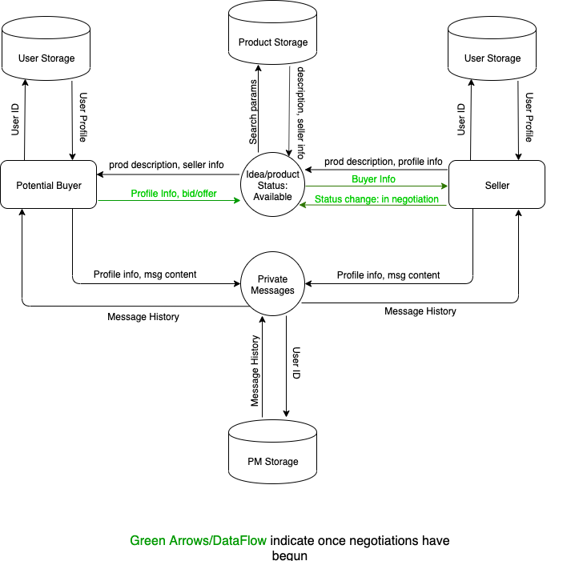

## Application Architecture Diagram
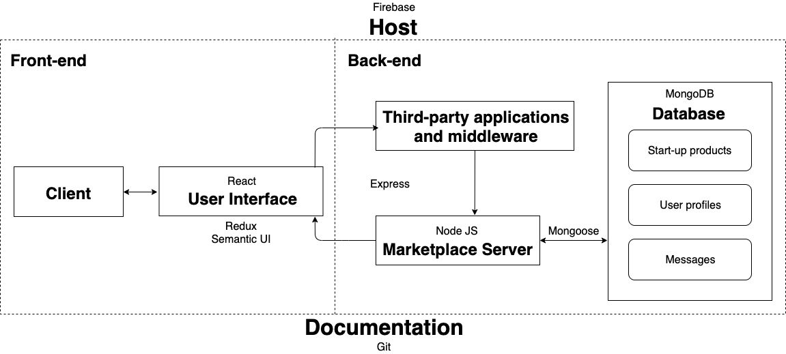

## User Stories

- As Fred, I want to advertise my partially developed technology so I can gauge interest in it.
  - As Greg, I want to create an ad for my partially developed start-up technology so that I can recover my losses.
  - As Greg, I want to be able to edit any ads I place out so that I can make updates or corrections.
  - As Greg, I want to be able to delete my ads so that I can prevent untimely messages.
  - As Sarah, I want to be able to view all listings I am interested in so I can compare them.
  - As Louis, I want to be able to tag my ads so that potential buyers can find them more easily.
  - As Louis, I want the ability to receive offers on my technology so I can get competitive deals.
  - As Louis, I want the ability to search by popularity so I can see competing ideas.
- As Peter, I want to see legitimate listings and user profiles so I know I can trust them.
  - As Sarah, I want to read a listing of different technologies with potential so that I can purchase new ventures.
  - As Bobby, I want to have authenticated login so that all user identities have an extra layer of authenticity.
  - As Bobby, I want to view the profiles of other users so I can understand more about them.
  - As Bobby, I want a dashboard to edit my profile so that I can update it at any time.
  - As Natalia, I want to have a website admin so that all listings, users, and messages are moderated.
  - As Natalia, I want to upload and swap contracts, NDAs and T&Cs so that legal issues can be handled.
- As Christina, I want to be able express my interest in a product so that potential sellers are aware of me.
  - As Sarah, I want to be able to directly message other users so that I can discuss their offerings.
  - As Reggie, I want the ability to leave comments and start conversations so I can see what other people think.
  - As Reggie, I want the option to buy or bid on a product so I can see the likelihood of a successful purchase.
  - As Natalia, I want to be able to search by category so I can easily see relevant and interesting technologies.

## Wireframes

**Desktop wireframes**

**Landing page**

**Sign in**

**Sign up**

**Dashboard**

**Listings**

**Individual listings**

**Mobile Wireframes**

____

**Welcome page** 

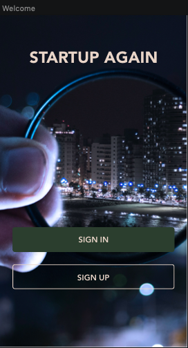

**Signup**

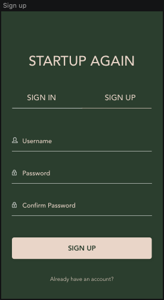

**Nav**

**Dashboard**

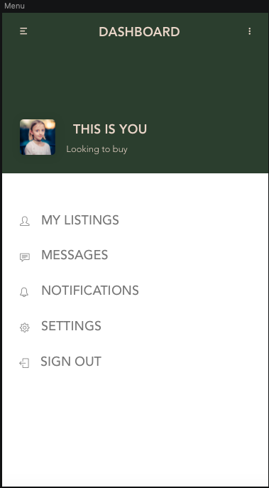

**Listing**

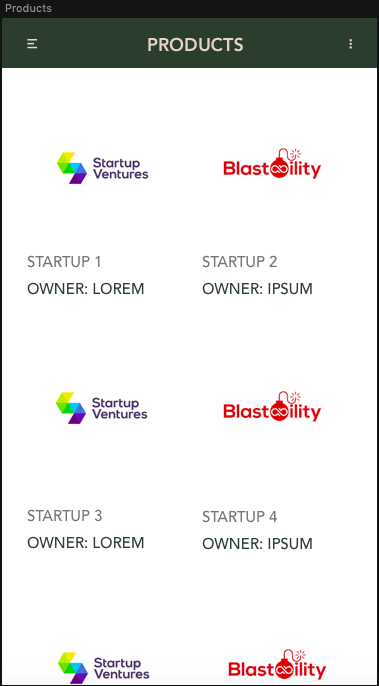

**Single listing**

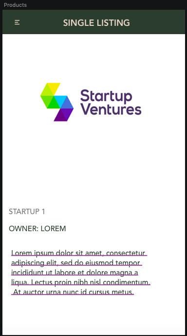

## Trello
[Live version](https://trello.com/b/xCccFJK4/mern-stack)

27/11/2019

[2/12/2019 - Morning](./docs/Trello/trello_02.png)

[2/12/2019 - Afternoon](./docs/Trello/trello_03.png)

3/12/2019
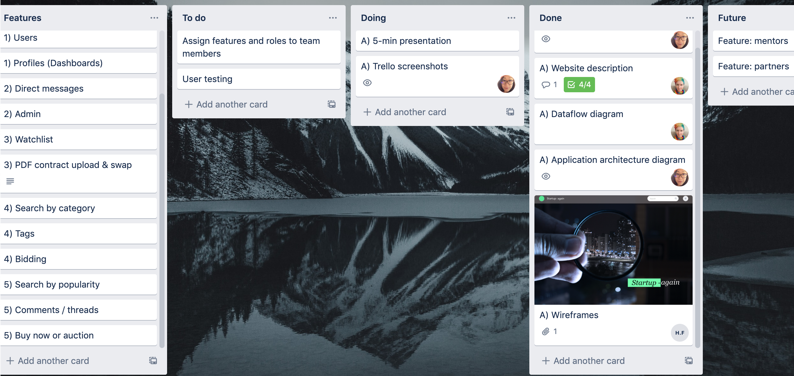

9/12/2019
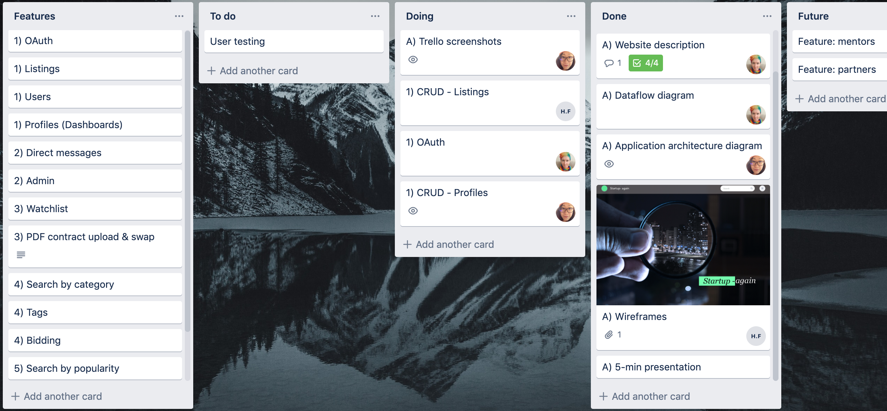

[13/01/2020](./docs/Trello/trello_06.png)

14/01/2020
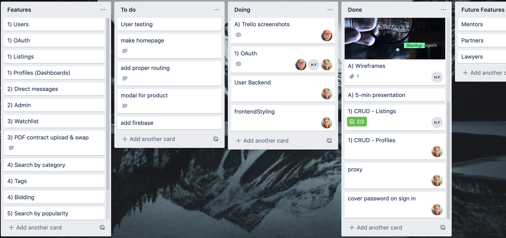

15/01/2020
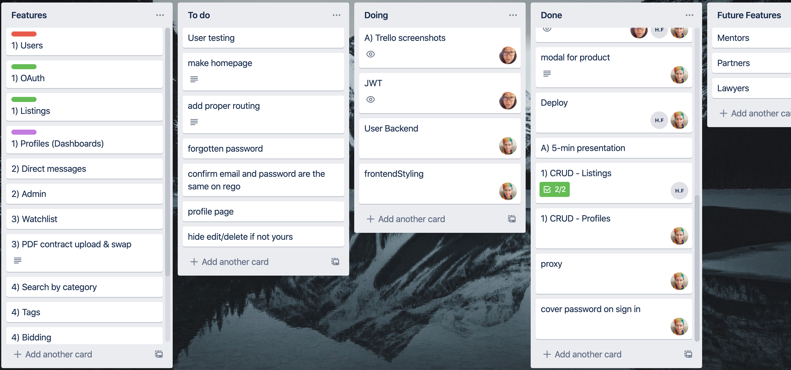

16/01/2020
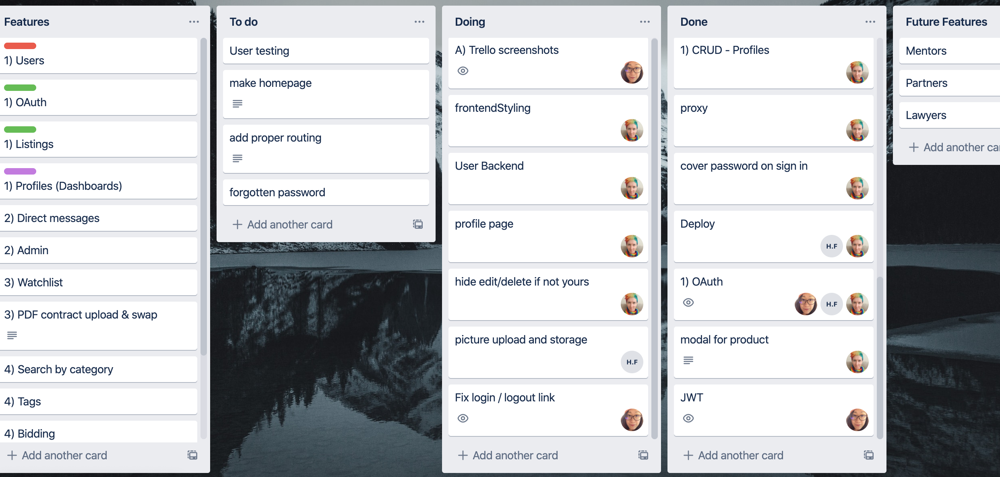

18/01/2020
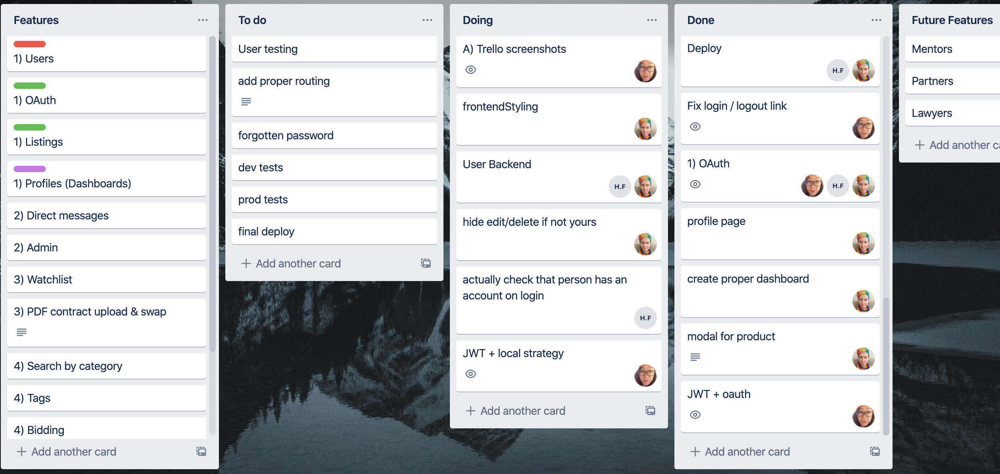